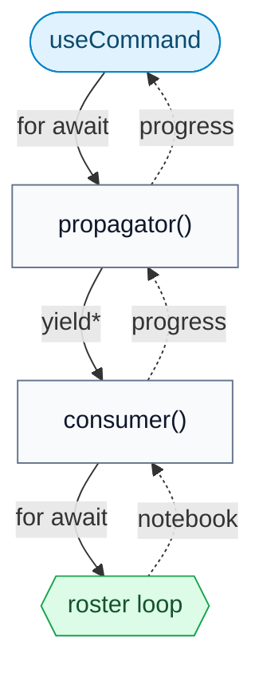
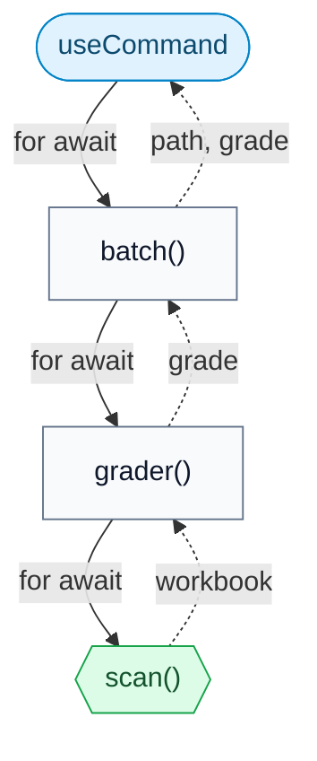
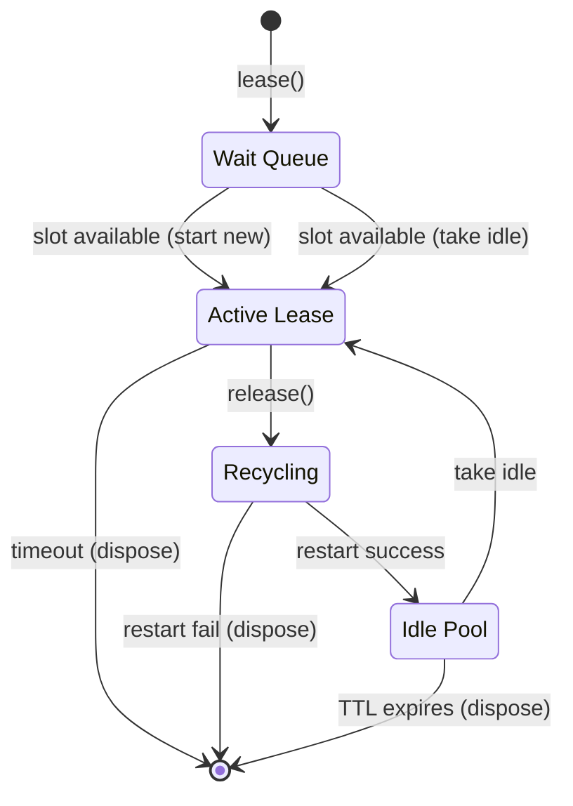

# Correxit design principles

This document describes the architectural decisions, data flow, and technical
principles of Correxit. It is written for anyone reading or working on the
codebase.

## Security

Correxit workbooks are Jupyter notebooks (`.ipynb` files) with rubric data in
their metadata. Because these files are shared between instructors and students,
integrity is paramount. Correxit only writes locked rubric contents to the
notebook metadata.

An author _can_ save a workbook while it is unlocked. Reference cells will
remain decrypted and readable, but the rubric itself stays locked and secure.
It is the author's responsibility to lock a workbook before distributing it.

Cryptographic keys exist only in memory. They enter via user input (passphrase
prompt or secrets manager) and are never serialized to disk or notebook metadata.
They die with the browser tab.

Correxit uses `openpgp.js` for encryption/decryption and native `window.crypto`
for signing. All fields use explicit nulls (`field: Type | null`) rather than
optional markers (`field?: Type`) to ensure stable JSON serialization, which is
required for deterministic cryptographic signatures.

## Architecture

Correxit is entirely client-side, there is no backend. All logic runs in the
browser.

Jupyter/Lumino commands serve as the controller layer. All user interactions and
long-running operations are mediated by a small API of commands that drive
multiple UI surfaces:

- the Correxit sidebar
- the Corrector widget for batch grading
- cell and notebook toolbar buttons

The architecture is divided into three layers:

| Layer                     | Responsibility                                                                                                                              | Modules                                                                             |
| ------------------------- | ------------------------------------------------------------------------------------------------------------------------------------------- | ----------------------------------------------------------------------------------- |
| **User Interface**        | Display state, accept user input, and execute commands. Purely declarative except for minimalist use of `ReactWidget`.                      | `src/ui/`, `src/corrector/`, `src/correxit/input.ts`, `src/correxit/use-command.ts` |
| **Commands**              | Defines all permissible actions and routes them to the business logic. Acts as an orchestrator of the Rubric/Workbook APIs.                 | `src/correxit/commands.ts`, `src/corrector/commands.ts`                             |
| **`Rubric` & `Workbook`** | Manages mutable state (`Workbook`), immutable operations (`Rubric`), cryptographic operations, file manipulation, and kernel communication. | `src/correxit/rubric.ts`, `src/correxit/workbook.ts`, et al.                        |

**Principle:** _All state mutations and actions flow through commands._ UI
components are declarative. They render state and execute commands, but never
call model functions directly.

## Data model: `Rubric` (`rubric.ts`)

The central data structure is the `Rubric`, stored in notebook metadata under
the key `correxit`. A Correxit `Workbook` is a Jupyter notebook that has a
`Rubric`, which describes how to grade and assign it.

A rubric is immutable. Each mutation returns a new instance (with a new
`revised` timestamp) via functions in `rubric.ts`.

A rubric exists in one of two mutually exclusive states:

### Locked and Unlocked

1. **`Rubric.Unlocked`**: The working state. Contains the decryption `key` and
   a decrypted `assignment.roster`. Used for editing, configuring, assigning,
   and certifying.

2. **`Rubric.Locked`**: The persisted state stored in notebook metadata. The
   `key` field is `null` and the `assignment.roster` is an encrypted string.
   Used for distribution and correction.

The `locked` boolean serves as the discriminator for TypeScript narrowing.

## Data model: `Workbook` (`workbook.ts`)

`Workbook` is an abstraction over Jupyter notebooks. A `Headed` workbook is
backed by an active `NotebookPanel` (visible in the UI), exposing only its `content` widget and its document `context`. A `Headless` workbook has only a
`context` and `content: null`. It is used for batch grading and scanning.

### Discriminated unions

Correxit uses TypeScript discriminated unions to encode mutually exclusive
states, enabling the compiler to enforce correctness:

- **`Rubric.Locked | Rubric.Unlocked`**: discriminated by `locked`.
- **`Reified`** (in `commands.ts`): encodes three possible states when
  resolving a workbook from command arguments. After `if (!rubric) return`,
  TypeScript knows `workbook` is non-null.

This eliminates classes of runtime errors by making invalid states
unrepresentable.

### Caching

`workbook.ts` uses a `WeakMap` to cache the current `Rubric` instance, avoiding
repeated decryption. `state.ts` maintains an in-memory `Map` of cell scores
with FIFO eviction.

### Active workbook

Command arguments must be serializable. Synchronous command logic (`isEnabled`,
`isVisible`) resolves the current workbook and cell via `state.workbook()` and
`state.cell()`. Async `execute` functions use `reify()` to resolve a workbook
by checking state and/or fetching when appropriate.

Use `Workbook.open()` to retrieve the current rubric.

## Asynchronous patterns

Long-running operations (propagation, grading, scanning) are implemented as
cold `async function*` generators. They do no work until iterated. Each `yield`
suspends execution until the consumer pulls the next value, providing automatic
backpressure.

### Generator pipelines

Each pipeline is a pull-driven chain of generators. Nothing moves until asked.

**Assignment propagation:** the propagator defines a roster loop (one notebook
per assignee) and hands it to the consumer as a factory via `yield*`. The
consumer decides _where_ to write by calling `stream(location)`, then iterates:

**Batch grading:** the batch command iterates a grader, which iterates scanned
workbooks. Each graded workbook is automatically certified when all cells are
resolved. Collection is a separate step invoked per-workbook after
certification:

Every pipeline is pull-driven and cold. The one intentionally _hot_ async
iterable is the `Monitor` plugin, which emits workbook changes as the user
switches tabs. It is backed by a Lumino `Stream`.

### `useCommand` (`use-command.ts`)

`useCommand` bridges async generators and React. It executes a command, iterates
its output via `for await`, buffers results, and flushes to component state at
~60fps via a `Throttler`. It handles cleanup on unmount.

## Kernel pool concurrency model

The kernel pool (`kernels.ts`) manages bounded concurrency for batch grading. It uses a semaphore-like `acquire()` mechanism to limit the number of active and recycling kernels. Released kernels are restarted and cached with a time-to-live (TTL) to avoid the overhead of starting new kernels for subsequent workbooks.

## Style

Correxit is built with functions, namespaces, and pure data. Classes appear only
where Jupyter APIs require them (e.g., `ReactWidget` wrappers). React's
functional components and hooks fit naturally.

Logic is expression-oriented: `map`, `filter`, `find`, `Object.fromEntries`
rather than imperative loops or `reduce` with spread.

Names should be single, distinct English words drawn from the domain:
`propagate`, `certify`, `lease`, `inject`, `reify`. Pattern words like
`producer`, `handler`, `manager` are avoided. Compound identifiers are
acceptable when convention demands it (e.g., `useCommand`, `setState`) but the
default is brevity.

## Plugins

Correxit provides extension points as JupyterLab plugins, each identified by a
single token. Core logic is decoupled from IO, e.g. replacing the file-system
consumer with an LMS consumer requires no changes to the propagator or commands.

| Plugin          | Purpose                                             | Default                       |
| --------------- | --------------------------------------------------- | ----------------------------- |
| **`Consumer`**  | Process propagated assignments                      | Writes to local filesystem    |
| **`Collector`** | Collect certified grades                            | Returns a UUID                |
| **`Registrar`** | Provide rosters for assignments                     | Returns null (manual entry)   |
| **`Submitter`** | Handle submission receipts                          | Returns a UUID                |
| **`Unlocker`**  | Manage rubric key lifecycle (store and unlock)      | Uses SecretsManager           |
| **`Monitor`**   | Yield the active workbook as the user switches tabs | `Stream`-based async iterable |

Type definitions are in `src/correxit/correxit.ts`. Default implementations are
in `src/plugins.tsx`.
