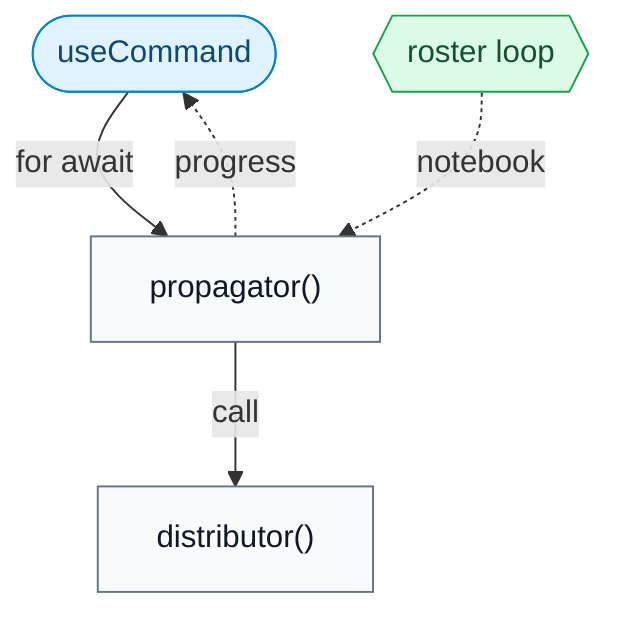
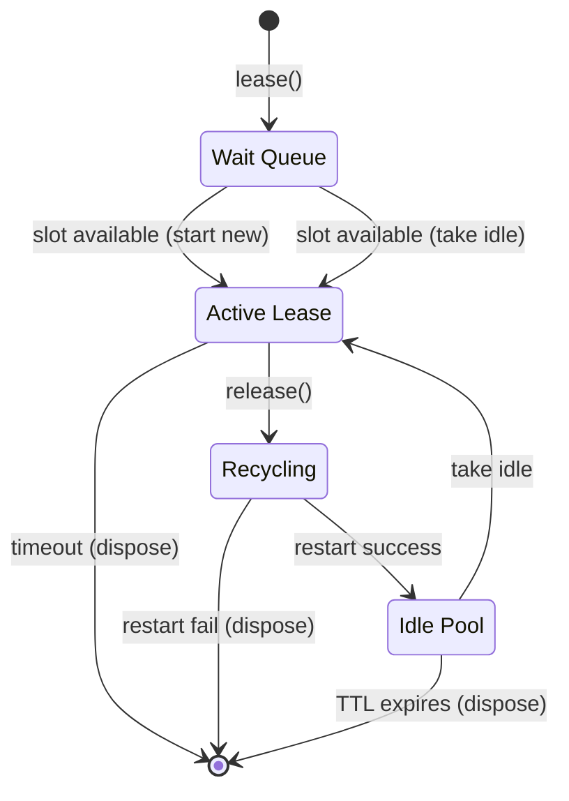

# Correxit design principles

This document describes the architectural decisions, data flow, and technical
principles of Correxit. It is written for anyone reading or working on the
codebase.

## Security

Correxit workbooks are Jupyter notebooks (`.ipynb` files) with rubric data in
their metadata. Because these files are shared between authors and students,
integrity is paramount. Correxit only writes locked rubric contents to the
notebook metadata.

An author _can_ save a workbook while it is unlocked. Reference cells will
remain decrypted and readable, but the rubric itself stays locked and secure.
It is the author's responsibility to lock a workbook before distributing it.

Cryptographic keys exist only in memory. They enter via user input (passphrase
prompt or secrets manager) and are never serialized to disk or notebook metadata.
They die with the browser tab.

Correxit uses `openpgp.js` for symmetric encryption/decryption and PGP
Curve25519 asymmetric encryption (sealed submissions), and native
`window.crypto` for HMAC-SHA-256 signing and PBKDF2 key derivation. All fields
use explicit nulls (`field: Type | null`) rather than optional markers
(`field?: Type`) to ensure stable JSON serialization, which is required for
deterministic cryptographic checks. The plaintext PGP private key exists
only in local scope during `unlock` and is discarded when the function returns.

## Architecture

Correxit is entirely client-side, there is no backend. All logic runs in the
browser.

## Accessibility

Correxit is built for education. That creates an explicit obligation to be
approachable by as many people as possible. Accessibility is not polish here,
it is part of the product's integrity.

UI work must preserve durable keyboard flows, explicit labels, visible focus,
live feedback for changing state, and cues that do not rely on color alone.
Prefer native controls when they fit. When a custom interaction is necessary,
its accessible name, focus behavior, and keyboard contract must be treated as
part of the feature, not as follow-up work.

Jupyter/Lumino commands serve as the controller layer. All user interactions and
long-running operations are mediated by a small API of commands that drive
multiple UI surfaces:

- the Correxit sidebar
- the Corrector widget for batch grading
- the Reviewer widget for per-cell manual review
- cell and notebook toolbar buttons and decorations

The architecture is divided into three layers:

- **User Interface**: displays state, accepts user input, and executes
  commands. It stays declarative except for minimal `ReactWidget` glue.
  Modules: `src/ui/`, `src/corrector/`, `src/correxit/input.ts`,
  `src/correxit/use-command.ts`, `src/corrector/bridge.ts`.
- **Commands**: define permissible actions and route them into the
  business logic. They orchestrate the `Rubric` and `Workbook` APIs.
  Modules: `src/correxit/commands.ts`,
  `src/corrector/commands.ts`.
- **`Rubric` & `Workbook`**: manage mutable notebook state, immutable
  rubric operations, cryptography, file manipulation, and kernel
  communication. Modules: `src/correxit/rubric.ts`,
  `src/correxit/workbook.ts`, and related helpers.

**Principle:** _All state mutations and actions flow through commands._ UI
components are declarative. They render state and execute commands, but never
call model functions directly.

## Data model: `Rubric` (`rubric.ts`)

The central data structure is the `Rubric`, stored in notebook metadata under
the key `correxit`. A Correxit `Workbook` is a Jupyter notebook that has a
`Rubric`, which describes how to grade and assign it.

A rubric is immutable. Each mutation returns a new instance (with a new
`revised` timestamp) via functions in `rubric.ts`.

A rubric exists in one of two mutually exclusive states:

### Locked and Unlocked

1. **`Rubric.Unlocked`**: The working state. Contains the decryption `key` and
   a decrypted `assignment.roster`. Used for editing, configuring, assigning,
   and certifying.

2. **`Rubric.Locked`**: The persisted state stored in notebook metadata. The
   `key` field is `null` and the `assignment.roster` is an encrypted string.
   Used for distribution and correction.

The `locked` boolean serves as the discriminator for TypeScript narrowing.

## Data model: `Workbook` (`workbook.ts`)

`Workbook` is an abstraction over Jupyter notebooks. A `Headed` workbook
is backed by an active `NotebookPanel` visible in the UI. It exposes only
its `content` widget and document `context`. A `Headless` workbook has
only a `context` and `content: null`. It is used for batch grading and
scanning.

### Caching

`workbook.ts` uses a `WeakMap` to cache the current `Rubric` instance, avoiding
repeated decryption. `state.ts` maintains an in-memory `Map` of cell scores
with FIFO eviction, the active reviewer cursor cell, and a `refreshed` signal
that triggers sidebar re-renders when cursor or state changes.

### Active workbook

Command arguments must be serializable. Synchronous command logic (`isEnabled`,
`isVisible`) resolves the current workbook and cell via `state.workbook()` and
`state.cell()`. Async `execute` functions use `reify()` to resolve a workbook
by checking state and/or fetching when appropriate.

Use `Workbook.open()` to retrieve the current rubric.

## Discriminated unions

Correxit uses TypeScript discriminated unions to encode mutually exclusive
states, enabling the compiler to enforce correctness:

- **`Rubric.Locked | Rubric.Unlocked`**: discriminated by `locked`.
- **`Headed | Headless`**: discriminated by `content`.
- **`Reified`** (in `commands.ts`): encodes three possible states when
  resolving a workbook from command arguments. After `if (!rubric) return`,
  TypeScript knows `workbook` is non-null.

This eliminates classes of runtime errors by making invalid states
unrepresentable.

## Asynchronous patterns

Long-running operations (propagation, grading, scanning) are implemented as
cold `async function*` generators. They do no work until iterated. Each `yield`
suspends execution until the caller pulls the next value, providing automatic
backpressure.

### Generator pipelines

Each pipeline is a pull-driven chain of generators. Nothing moves until asked.

**Assignment propagation:** the propagator defines the roster loop, creates the
local notebooks unconditionally, and optionally calls a distributor leaf
function per assignee:

**Batch grading:** the batch command iterates a grader, which iterates scanned
workbooks. Each graded workbook is automatically certified when all cells are
resolved. Collection is a separate step invoked per-workbook after
certification:

Every pipeline is pull-driven and cold. The one intentionally _hot_ async
iterable is the `Monitor` plugin, which emits workbook changes as the user
switches tabs. It is backed by a Lumino `Stream`.

### `useCommand` (`use-command.ts`)

`useCommand` bridges async generators and React. It executes a command, iterates
its output via `for await`, buffers results, and flushes to component state at
~60fps via a `Throttler`. It handles cleanup on unmount.

### Reviewer bridge (`bridge.ts`)

The Corrector and Reviewer are separate widgets that share state: the Corrector
owns the list of scanned workbooks and collated grades, while the Reviewer owns
the navigation cursor. `bridge.ts` is a lightweight `useSyncExternalStore`-based
external store that lets the Corrector `publish()` workbook/grade snapshots and
the Reviewer `navigate()` to a cursor position. The Reviewer subscribes via
`useSnapshot()`. This avoids coupling the two widgets through props or context.

## Kernel pool concurrency model

The kernel pool (`kernels.ts`) manages bounded concurrency for batch
grading. It uses a semaphore-like `acquire()` mechanism to limit active
and recycling kernels. Released kernels are restarted and cached with a
time-to-live (TTL) to avoid the cost of starting fresh kernels for later
workbooks.

## Style

Correxit is built with functions, namespaces, and pure data. Classes appear only
where Jupyter APIs require them (e.g., `ReactWidget` wrappers). React's
functional components and hooks fit naturally.

Logic is expression-oriented: `map`, `filter`, `find`, `Object.fromEntries`
rather than imperative loops or `reduce` with spread.

Names should be single, distinct English words drawn from the domain:
`propagate`, `certify`, `lease`, `inject`, `reify`. In the core codebase,
pattern words like `producer`, `handler`, `manager` are avoided, though plugin
authors are free to use whatever idioms match their environment. Compound
identifiers are acceptable when convention demands it (e.g., `useCommand`,
`setState`) but the core default is brevity.

## Plugins

Correxit provides extension points as JupyterLab plugins, each identified by a
single token. Core logic is decoupled from IO, e.g. replacing a distributor
implementation requires no changes to the propagator loop or commands.

- **`Distributor`**: delivers one propagated workbook. Default: manual
  no-op.
- **`Collector`**: collects certified grades. Default: digest receipt.
- **`Registrar`**: provides assignment registrations. Default: `null`
  for manual entry.
- **`Submitter`**: handles submission receipts. Default: digest receipt.
- **`Unlocker`**: manages rubric key lifecycle. Default:
  `SecretsManager`.
- **`Monitor`**: yields the active workbook as the user switches tabs.
  Default: `Stream`-based async iterable.

Type definitions are in `src/correxit/correxit.ts`. Default implementations are
in `src/plugins.tsx`. See [PLUGINS.md](PLUGINS.md) for the full integration
API.

## Design philosophy

Correxit is dense by design. Files are self-contained, and functions say
exactly what they do with the fewest tokens necessary. A function carries
significant meaning per line, but remains independently readable. The goal is
to let you understand a module without holding the rest of the system in your
head.

Some guiding principles:

- **Say the most with the fewest words.** Every name, every line, every
  structural choice should earn its place. If something can be removed without
  loss, remove it.
- **Vocabulary discipline.** Each word in the codebase has exactly one meaning.
  `workbook`, `rubric`, `grade`, `cell`, `lease`: these are domain terms with
  stable definitions. Naming is load-bearing.
- **Pull over push.** Async generators compose via `yield*` delegation. The
  caller controls the pace. This is simpler and more composable than signal
  graphs or event emitters.
- **Framework seams.** Correxit integrates with JupyterLab's core primitives
  (commands, widget lifecycle, plugin tokens) while adopting functional
  patterns (generators, pure data structs, external stores) for state and
  data flow.
